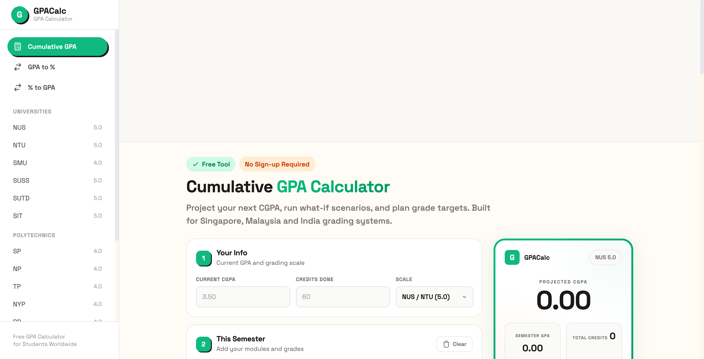

# GPA Calculator - Free Online CGPA Calculator

Calculate your cumulative GPA and project semester results with school-specific grading scales. Built for students in Singapore, Malaysia, India, and the United States.

**[Use the Calculator](https://gpacalc.app)**



## Features

- **Cumulative GPA projection** - Enter your current CGPA and credits, add this semester's modules, and see your projected CGPA instantly
- **School-specific grading scales** - Pre-configured grade points for 18+ institutions
- **GPA to Percentage converter** - Convert GPA to percentage for 4.0, 5.0, and 10.0 scales
- **Percentage to GPA converter** - Convert percentage scores back to GPA
- **Shareable result cards** - Download your GPA result as a PNG image or share directly to social media
- **No sign-up required** - Completely free, works in the browser

## Supported Schools

### Singapore Universities (5.0 Scale)
NUS, NTU, SMU, SUSS, SUTD, SIT

### Singapore Polytechnics (4.0 Scale)
SP, NP, TP, NYP, RP

### Malaysia (4.0 Scale)
UM, UKM, USM, UTM, UPM

### Other Scales
- US Standard (4.0)
- India CGPA (10.0)

## How It Works

```
Projected CGPA = (Current CGPA x Credits Done + Semester Points) / Total Credits
Semester Points = Sum of (Grade Point x Module Credit)
```

1. Enter your current CGPA and completed credits
2. Add this semester's modules with expected grades
3. The calculator updates your projected CGPA in real time
4. Share or download the result card

## Tech Stack

- [Astro](https://astro.build) - Static site generator
- [Tailwind CSS](https://tailwindcss.com) - Utility-first CSS framework
- Deployed on [Cloudflare Pages](https://pages.cloudflare.com)

## Development

```bash
npm install
npm run dev
```

Open `http://localhost:4321` in your browser.

### Build

```bash
npm run build
```

Output goes to `dist/`.

## License

[MIT](LICENSE)
